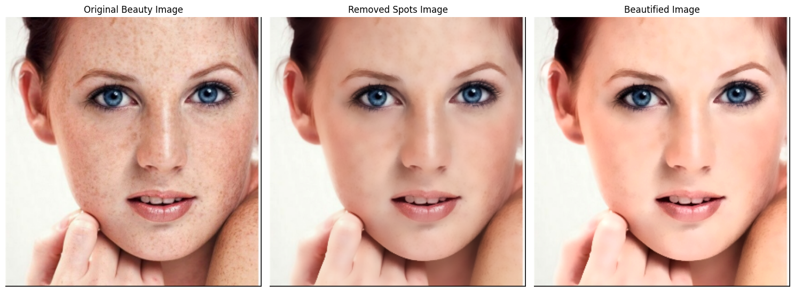
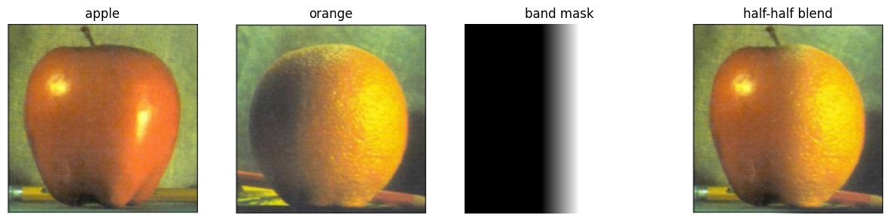

# 项目简介

本项目为图像处理作业。

# 复现步骤（通过 uv）

1. 确保已安装 uv 工具
2. 克隆项目代码：
    ```bash
    git clone https://github.com/riemac/image_homework
3. 请查看项目中的 `experiments` 目录，其中包含运行实验得到的详细结果、日志和可视化图像。通过对比不同实验设置，可以直观了解参数变化对结果的影响。

# 实验结果
## 美女图像美化

## 苹果橘子图像融合

